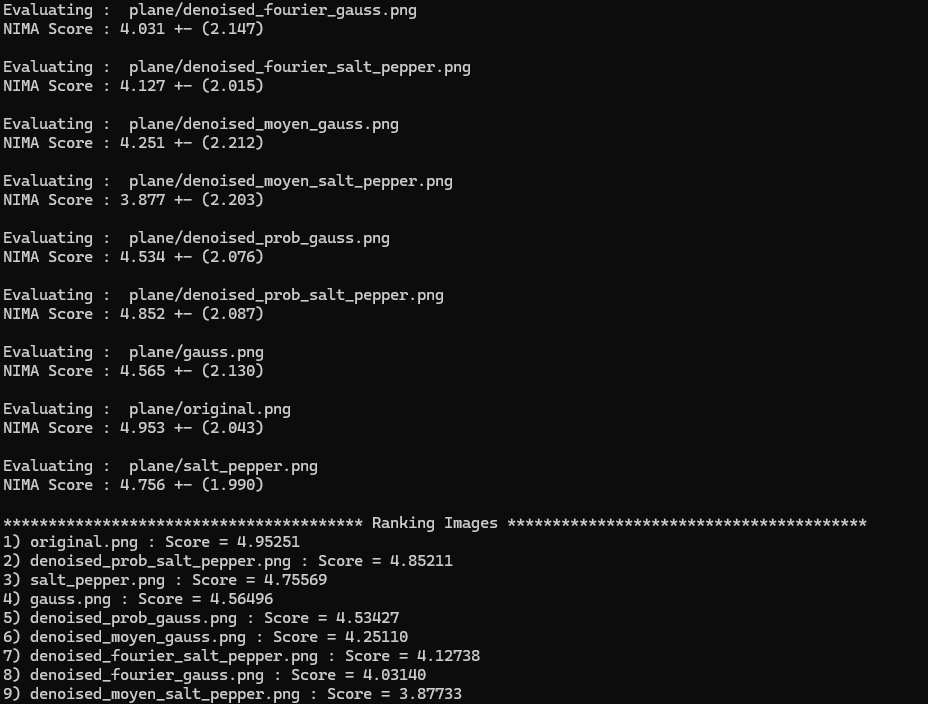

# Neural Image Assessment (NIMA)

Ce code contient une partie du code cloné depuis le dépôt GitHub suivant :  
**[Neural Image Assessment (NIMA), dépot de titu1994](https://github.com/titu1994/neural-image-assessment)**  

**Note importante** : Ceci notre création. Il appartient à son auteur original et a été cloné uniquement évaluer des images grâce à un modèle pré-entrainé de NIMA

---

## Installation et configuration de l'environnement Python

Il est recommandé d'utiliser un environnement Python virtuel pour éviter les conflits avec les dépendances d'autres projets. Voici comment le configurer : 

### Mise en place de l'environnement

#### Sous Windows :
```bash
python -m venv nima_env
nima_env\Scripts\activate
```

#### Sous Linux :
```bash
python3 -m venv nima_env
source nima_env/bin/activate
```

### Installation des dépendances

Installez les packages nécessaires spécifiés dans le fichier requirements.txt :
```bash
pip install -r requirements.txt
```

---

## Évaluation des images avec NIMA

Il y a pour le moment deux modèles déjà prée-entrainé que vous pouvez utiliser pour évaluer une ou plusieurs images. En fonction des images, choisissez le modèle qui parait le plus cohérent.
Il existe plusieurs options :

### Évaluer un dossier entier d'images
Utilisez l'option *-dir* pour évaluer toutes les images (formats **png**, **jpg**, **jpeg**) présentes dans un dossier :

Exemple :
```bash
python evaluate_<model>.py -dir /chemin/vers/le/dossier/images
```

### Évaluer une ou plusieurs images spécifiques

Utilisez l'option *-img* pour spécifier un ou plusieurs chemins d'images :

Exemple :
```bash
python evaluate_<model>.py -img /chemin/vers/image1.jpg /chemin/vers/image2.png
```

### Redimensionner les images avant l'évaluation

Utilisez l'option *-resize* pour activer ou désactiver cette fonctionnalité :

Exemple :
```bash
python evaluate_<model>.py -img /chemin/vers/image.jpg -resize true
```

```bash
python evaluate_<model>.py -img /chemin/vers/image.jpg -resize false
```

## Résultat avec des images bruités et débruités
Dans le cadre de notre projet, nous avons utilisé cette métrique pour mesurer la performance de nos différentes méthodes de débruitage.
Voici les résultats obtenus avec le dossier d'image *example_image* :




